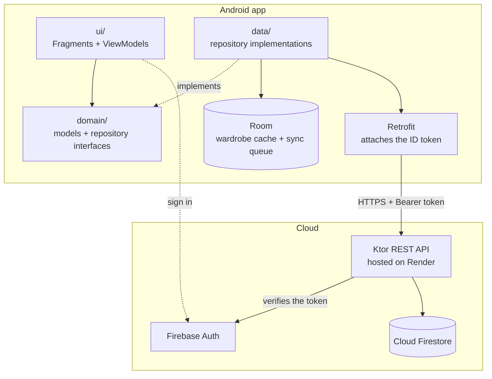
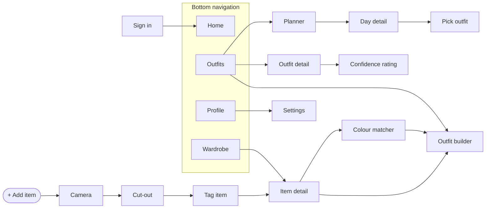

# RUNWAY

A digital wardrobe app for Android. Photograph your clothes, build outfits on a drag-and-drop canvas, plan them across a month, and see what everything actually costs you per wear.

Built for PROG7314 Part 2 by Group 11, from the design and clickable prototype produced in Part 1.

## What it does

The problem is a full wardrobe with nothing to wear: clothes that were bought, worn twice and then forgotten. You photograph a garment once, and the app tracks it from there.

| Feature | What it does |
|---|---|
| Sign in | Google SSO through Firebase Auth, with optional biometric unlock |
| Add an item | Photograph it, cut the background out on the device, then tag it |
| Wardrobe | Browse, filter and sort, with cost per wear and wear logging |
| Colour matcher | Finds what else in the wardrobe goes with a given garment |
| Outfit builder | Drag, scale, rotate and layer garments on a canvas |
| Planner | A month grid: schedule an outfit to a day, or clear it |
| Confidence ratings | Rate an outfit after wearing it |
| Offline | Wardrobe changes queue locally and sync on reconnect |

**Scope.** Part 2 is a working Android client against our own REST API, with real authentication, offline support and automated tests. Some screens are deliberate placeholders for Part 3 and say so on screen: weather suggestions, the swap market, laundry, insights, notifications, language switching, onboarding, and editing an item after it is added.

## Screenshots

Not captured yet. Save them into `docs/screenshots/` under these names and they will appear here:

`sign-in.png` · `home.png` · `wardrobe.png` · `add-item-cutout.png` · `outfit-builder.png` · `planner.png` · `profile.png`

With an emulator running, this writes one straight to disk:

```bash
adb exec-out screencap -p > docs/screenshots/home.png
```

## Stack

| Concern | Choice |
|---|---|
| Language | Kotlin 2.3.10 |
| UI | Android view system, XML layouts, Material 3 |
| View access | ViewBinding, with no `findViewById` in the codebase |
| Architecture | MVVM with unidirectional data flow |
| Persistence | Room 2.8.4 (via KSP) |
| Navigation | Navigation component, single Activity + XML nav graph |
| Build | AGP 9.3.2 / Gradle 9.5, Kotlin DSL + version catalog |
| Min SDK | 26 (Android 8.0), compileSdk 37 |

The view system was chosen over Compose deliberately, while the repository still held only scaffolding, so nothing of substance was rewritten.

### Component library

Every screen is built from a shared component library ported from the Part 1 prototype, rather than from per-screen layouts. That is what keeps twenty-odd screens looking like one product with four people building in parallel. Colours are defined under semantic names (`rw_accent`, `rw_surface`, `rw_muted`) and redefined for Night, so a single `themes.xml` covers both schemes. Anything expressible as a style is a style; custom views exist only where the composition cannot be declared in XML. `CatalogActivity`, reachable from a button on any tab, renders every component on one screen.

## Architecture

Two independent Gradle builds in one repository. They share a Git history and nothing else, so open each in its own Android Studio window.

```
PROG7314-POE-P2-GROUP11/
├─ app/    the Android app   (Android Gradle Plugin)
└─ api/    the REST API      (plain JVM Kotlin, Ktor)
```



The app is layered: `ui` depends on `domain`, and `data` implements the interfaces `domain` declares. A ViewModel is written against `ItemRepository` and cannot tell whether an item arrived from Room or from the network.

### Key decisions

- **MVVM, one way.** Each ViewModel exposes one immutable `UiState` through a `StateFlow`. A screen has no other route by which it can change itself.
- **The domain layer is plain Kotlin.** No Room annotations and no Android imports, so the business logic is unit-testable on the JVM with no emulator.
- **Manual dependency injection.** `AppContainer` builds the object graph by hand. No Hilt, no annotation processing, and nothing to learn before adding a repository.
- **Offline-first where it pays.** The wardrobe queues changes in Room and syncs on reconnect. Outfits, plans and ratings are API-only, because those actions are rare enough that failing honestly beats queueing silently.
- **One switch for the API host.** `useHostedApi` in `app/build.gradle.kts` is the only place a hostname appears.
- **The server owns ownership.** Every endpoint filters by the uid from the verified token, and another user's record returns 404, not 403, since a 403 would confirm the record exists.

### Navigation

`MainActivity` is the only Activity. It hosts a `NavHostFragment` and owns what outlives any one screen: the bottom navigation, the add-item button and the offline banner. Every screen is a Fragment.



## Running it

Two processes, in this order. The API must be listening before the app asks it for anything.

### Prerequisites

| Need | Where it comes from |
|---|---|
| JDK 21 | [Temurin 21](https://adoptium.net/temurin/releases/?version=21) |
| Android SDK | Android Studio. `local.properties` is git-ignored, so create it with `sdk.dir` if Studio has not. |
| `api/serviceAccountKey.json` | Firebase console → Project settings → Service accounts → Generate new private key. Never commit it. |
| `app/google-services.json` | Firebase console → Project settings → Your apps → Android → Download |
| Your debug SHA-1 registered | `./gradlew signingReport`, then Firebase → Your apps → Add fingerprint |

Every developer has their own debug keystore, so each team member must register their own SHA-1. Without it Google Sign-In returns a null token and the app reports "invalid account" with no further explanation.

### 1. Start the API

```powershell
cd api
.\run-api.ps1
```

Wait for `Responding at http://0.0.0.0:8080`. Gradle will sit at `83% EXECUTING` and never reach 100%, which is correct: the task only finishes when the server stops. Check `http://localhost:8080/health` and `http://localhost:8080/swagger` in a browser.

### 2. Run the app

Open the repository root in Android Studio, in a separate window from `api/`, and run on an emulator on API 26 or higher.

One line at the top of `app/build.gradle.kts` decides which API the app talks to:

```kotlin
val useHostedApi = true
```

`true` uses the hosted API on Render, which is what a physical phone needs. `false` uses an API running on this machine at `http://10.0.2.2:8080`, which is how the emulator reaches the host. Sync Gradle after changing it.

The hosted API sleeps when idle on Render's free tier, so the first request after a quiet spell takes around thirty seconds. That is the platform, not the app.

| Symptom | Cause |
|---|---|
| 401 on every request | SHA-1 not registered, or Google sign-in not enabled in Firebase |
| `Failed to connect to /10.0.2.2:8080` | The API is not running |
| `FAILED_PRECONDITION` in the API log | A missing Firestore index. The log line links to a page that creates it. |

## Testing

| Suite | Count | Command |
|---|---|---|
| Android unit tests | 171 | `./gradlew :app:testDebugUnitTest` |
| API unit tests | 39 | `cd api && ./gradlew test` |

They cover the pure rules (`ItemDraft`, `OutfitCanvas`, `ColourMatcher`), the repositories and their mappers, and the ViewModels behind the wardrobe, outfits, builder and planner.

The API documents itself at `http://localhost:8080/swagger`, generated from `api/src/main/resources/openapi/documentation.yaml`. Everything except `/health` needs a Firebase ID token, pasted into **Authorize** (Swagger adds the word Bearer itself).

## Version control

GitHub: [st10434242/PROG7314-POE-P2-GROUP11](https://github.com/st10434242/PROG7314-POE-P2-GROUP11). 72 commits, 20 merged pull requests and 4 contributors since 6 September 2026.

Nobody commits to `main`. A ticket is taken from the Jira board, built on its own branch, and merged through a pull request that another team member reviews. Branches are named for the kind of work plus the ticket, such as `Feature/SCRUM-104,105`, `Bug/fix-build-on-main` or `Setup/Firebase-and-authentication`. A few early branches predate that convention.

Commit messages lead with the ticket they close, so the history can be read against the board:

```
SCRUM-134 splash screen
SCRUM-136, SCRUM-140
```

`app/google-services.json` and the shared debug keystore are committed on purpose: the project will not build without the first, and a debug keystore is not a secret, so a fresh clone signs with a certificate Firebase already knows. The Firebase Admin key (`api/serviceAccountKey.json`), release keystores, `local.properties` and build output are never committed.

## Continuous integration

**Coming soon: SCRUM-147.** A GitHub Actions workflow that builds the app and runs both test suites on every push and pull request. It will live in `.github/workflows/`, and this section will describe it once it is in place. Until then both suites are run locally before a pull request is opened.

## AI usage

Generative AI was used in a limited support role. The declaration required by the brief is in [AI-REPORT.md](AI-REPORT.md).

## Team

Group 11, PROG7314.

| Name | Student number |
|---|---|
| Cherubim Estologa | ST10443277 |
| David Botha | ST10446408 |
| Divan Fourie | ST10434242 |
| Mpho Molefe | ST10317078 |
